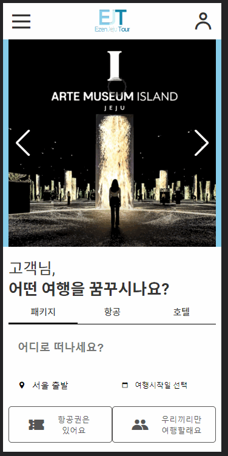
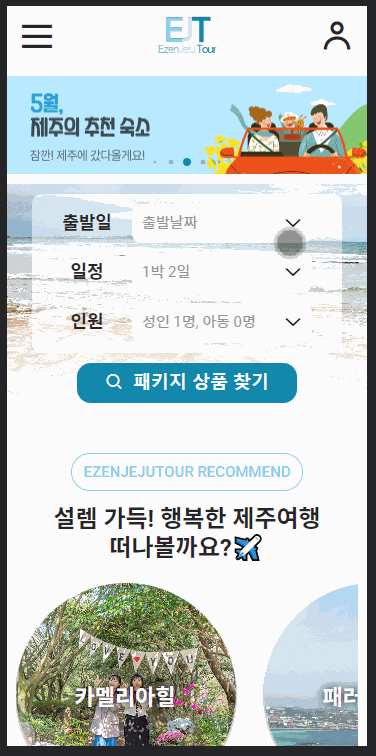
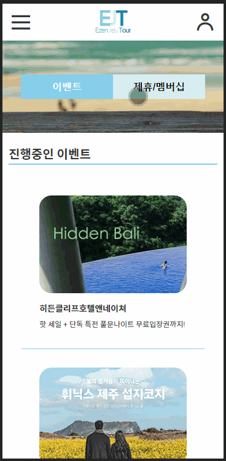
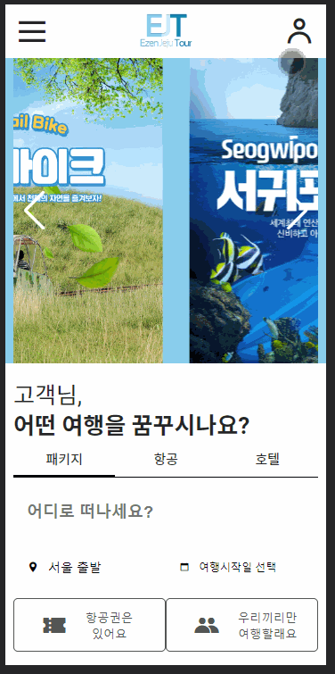

# 여행사 홈페이지 제작 - 이젠제주투어_모바일.ver (팀작업)

## 팀원

|             | 이름   | Github                                  | 작업사항                                                                                                                                                                                                                                                                                                                             |
| :---------- | :----- | :-------------------------------------- | :----------------------------------------------------------------------------------------------------------------------------------------------------------------------------------------------------------------------------------------------------------------------------------------------------------------------------------- |
| FE          | 김하진 | [@HajinKimm](https://github.com/HajinKimm) | [여행패키지](https://yeonhub.github.io/TP-EZtour_vanillaJS_mobile/package.html) [레저/잠수함](https://yeonhub.github.io/TP-EZtour_vanillaJS_mobile/active.html) [공원/전시/박물관](https://yeonhub.github.io/TP-EZtour_vanillaJS_mobile/museum.html) [Restaurant](https://yeonhub.github.io/TP-EZtour_vanillaJS_mobile/food.html) |
| FE          | 김형종 | [@Ocjji](https://github.com/Ocjji)         | [메인](https://yeonhub.github.io/TP-EZtour_vanillaJS_mobile) [공지사항](https://yeonhub.github.io/TP-EZtour_vanillaJS_mobile/notice.html) [자주 묻는 질문](https://yeonhub.github.io/TP-EZtour_vanillaJS_mobile/qna.html)                                                                                                           |
| FE / design | 이명관 | [@audrhks29](https://github.com/audrhks29) | [이벤트](https://yeonhub.github.io/TP-EZtour_vanillaJS_mobile/promotion.html) [제휴/멤버십](https://yeonhub.github.io/TP-EZtour_vanillaJS_mobile/membership.html) [로그인](https://yeonhub.github.io/TP-EZtour_vanillaJS_mobile/login.html)/[회원가입](https://yeonhub.github.io/TP-EZtour_vanillaJS_mobile/join.html)                 |
| FE          | 이상연 | [@yeonhub](https://github.com/yeonhub)     | [항공권](https://yeonhub.github.io/TP-EZtour_vanillaJS_mobile/airport.html) [호텔](https://yeonhub.github.io/TP-EZtour_vanillaJS_mobile/hotel.html) [렌터카](https://yeonhub.github.io/TP-EZtour_vanillaJS_mobile/rent.html)                                                                                                        |

ddd

# 프로젝트 사이트

 
 

# 프로젝트 참고 사이트

1. <a href="https://www.jeju.com/" target="_blank">제주닷컴</a>
2. <a href="https://www.hanatour.com/" target="_blank">하나투어</a>

# 프로젝트 기술 스택

- [X] HTML
- [X] CSS
- [X] Vanilla Script

# 프로젝트 기능 구현

## 1) header

* 햄버거 메뉴 클릭 시 전체 메뉴
* new date로 현재 날짜, 시간별 운영시간 출력

## 2) 메인

* visual rolling
* visual button 구현
* search box (패키지, 항공, 호텔)
* content 변경 구현

## 3) 여행 패키지

* search box 구현
* visual rolling

## 4) 특가 예약

* visual rolling
* visual button 구현
* search box (왕복, 편도)
* search box 구현 (popup)
* content 변경 구현
* rent search box 시간 select/option 구현
* rent type 선택 시 해당 type 출력

## 5) 관광지

* visual rolling
* visual page button 구현
* contents swipe

## 6) 프로모션

* 이벤트-제휴/멤버십 웹앱 형식 이동
* 이벤트 content 클릭 시 상세 페이지 이동

## 7) 고객센터

* 공지사항 type 클릭 시 해당 내용 출력
* page 번호 구현
* 자주 묻는 질문 제목 클릭 시 답변 출력

## 8) 로그인

